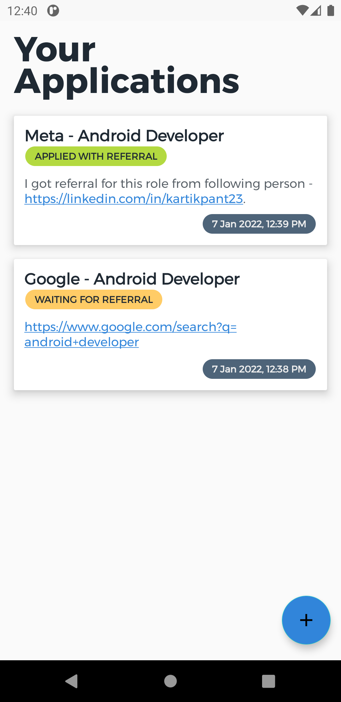
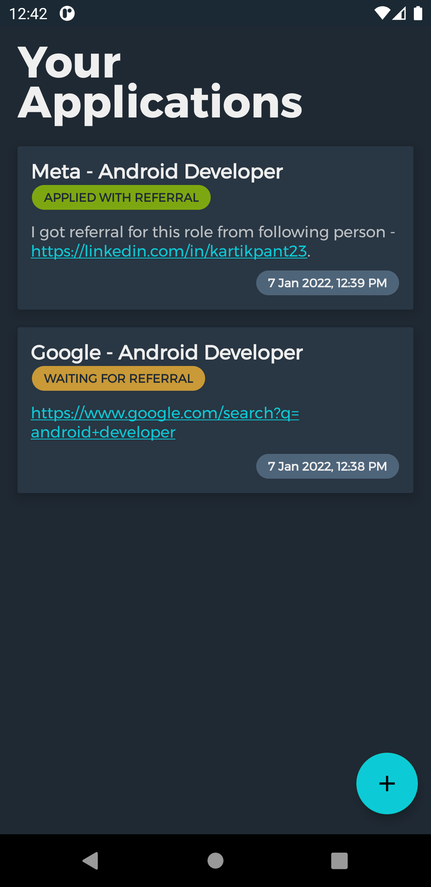
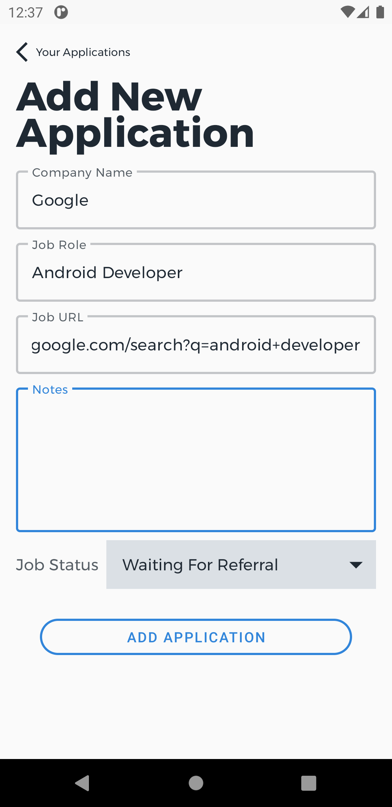
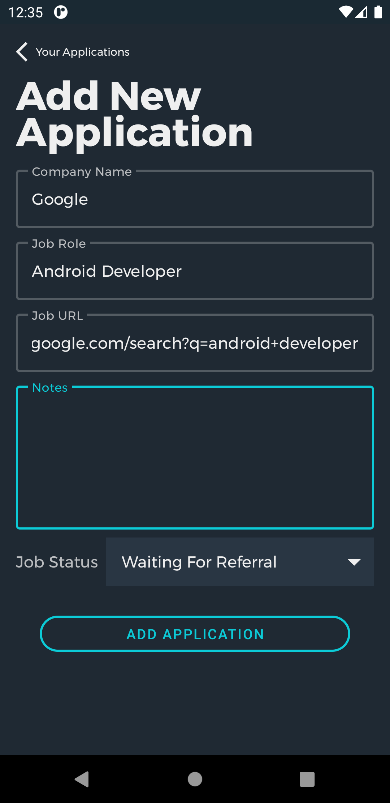
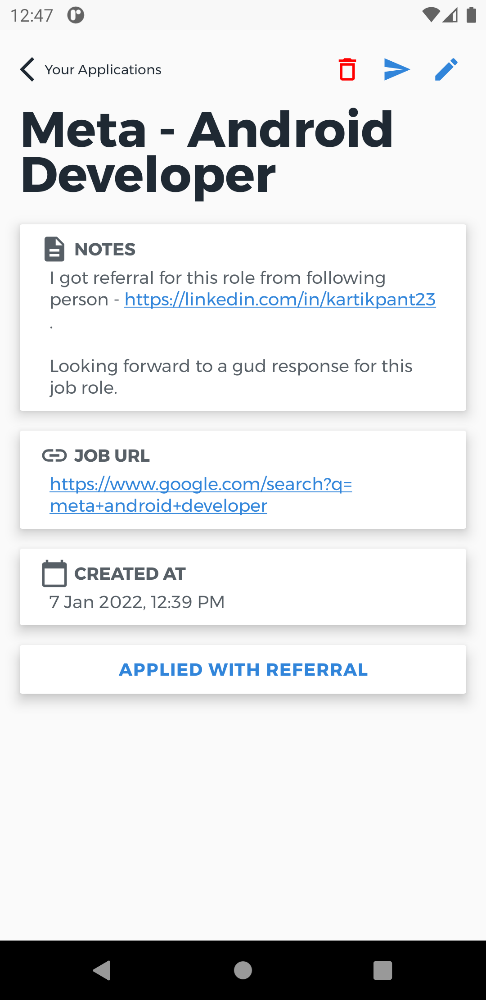
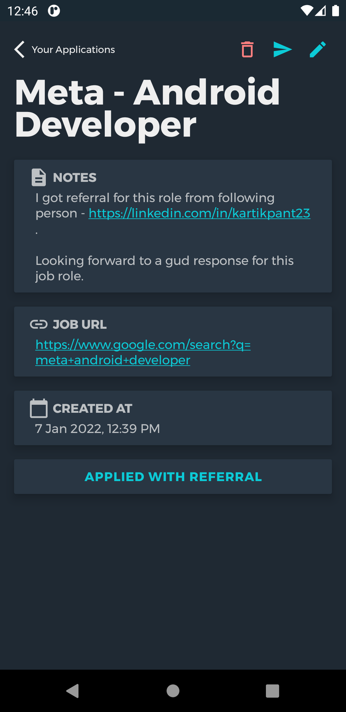

# Applications Tracker

## Problem Statement
Lately I have been applying for many roles, and it has become a hard task to keep track of all the applications. Spreadsheets are a great way to store this data, but we understand how hard it becomes to check it regularly. We all like how **Mobile Applications** are so efficient to use and increase the accessibility, and so seem the appropriate solution to this problem.

## Proposed Solution
So this is an attempt to make our lives easier, a dedicated app for the purpose of storing job applications only. All the roles that you apply for, **add** them up inside the app, mark if you are **waiting for a referral**, or have you **applied** or not, and get **regular notifications** to remind you about these status, so that you don't keep waiting for the referral the next time you apply. You can easily make changes to applications data and/or even delete them whenever needed.

## Functionality and Concepts Used
App has a simple and intuitive user interface, that allows users to add data about their applications, they can edit the applications and even delete them whenever needed. App makes use of Android Jetpack. Jetpack is a suite of libraries to help developers follow best practices, reduce boilerplate code, and write code that works consistently across Android versions and devices so that developers can focus on the code they care about. 

In this project following libraries are used -
| Library | Used For|
|---------|:--------|
|[Constraint Layout](https://developer.android.com/jetpack/androidx/releases/constraintlayout)|Most activities make use of constraint layout, which is easy to handle with different screen sizes.|
|[Recycler View](https://developer.android.com/jetpack/androidx/releases/recyclerview)|To display list of all the applications that user has added, we use recycler view, which is the best practice to display long lists.|
|[Navigation](https://developer.android.com/jetpack/androidx/releases/navigation)|Navigation between all the present screens is handled using Navigation Library which makes it easier to handle fragment transactions, and to pass the data between them.|
|[Room](https://developer.android.com/jetpack/androidx/releases/room)|Data is being stored inside SQLite database, and Room library makes it easier to work with all these database related stuff.|
|[Lifecycle](https://developer.android.com/jetpack/androidx/releases/lifecycle)|We are using LiveData to update and observe live changes in the applications that user has added. Screens are updated in real time and user is able to track the applications.|
|[WorkManager](https://developer.android.com/jetpack/androidx/releases/work)|We are using WorkManager to provide periodic notifications to the user, depending upon the status of their applications. Using WorkManager, we are assured that user is notified regularly.|

## Screenshots
App comes with both Light and Dark themes. Soft colors and a minimalist design is used, hence enhancing user experience. Screenshots of the screens created so far are added below - 
> I don't think there are anymore screens that need to be created, I have built all the screens and we will work on fixing issues and adding features.

|    | Light UI | Dark UI |
|----|----------|---------|
|Home Screen|||
|Add Application|||
|Application Details|||

## App Link and Future Scope
App is being tested among some students from IIIT Bhopal and has a limited number of users. App can be tested using this [link](https://github.com/kartik-pant-23/applications-tracker/releases/download/v1.0.1/applications-tracker-v1.0.1.apk). For getting the latest version of the app, you can check [releases](https://github.com/kartik-pant-23/applications-tracker/releases).
Once app is fully tested, it will be uploaded to [PlayStore]().

Following features will be added in future - 
* **Draft Messages** - Users can create a message template which then can be sent via email, linkedin message, etc.
* **Filtering Lists** - There should be a way for user to organize and filter applications list.

## Contribution
Before you start contributing, keep following things in mind - 
* In case you are doing anything related to UI(Adding Features, Enhancements, Bug Fixes), make sure you to attach revelant images.
* Don't work on an issue, that has been assigned to someone else.
* Work on an issue, only if it has been assigned to you.
* Be respectful to fellow contributors and maintainers.
